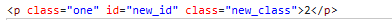
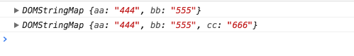
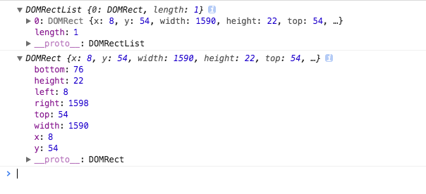

##  创建元素

* **创建元素：`document.createElement()`**

该方法只接受一个参数：创建的元素标签名，如：

```js
const div = document.createElement('div');
```

通过 `createElement()` 方法创建新元素的同时，也为新元素设置了 `ownerDocument ` 属性，并可操作该元素的属性，如：

```js
div.id = 'newDiv';
div.className = 'new-div';
```

此时，新元素并未被添加到文档树中，因此对该元素的操作并不影响浏览器的显示。要将新创建的元素添加到文档树，可通过 `appendChild()`、`insertBefore()`、`replaceChild()` 方法。

```js
document.body.appendChild(div);
```

当元素添加到文档书中后，针对该元素的操作都会实时的反映到浏览器中。

* **创建文本节点：`document.createTextNode()`**;

该方法接受一个参数：要插入节点的文本，如：

```js
var nodeText = document.createTextNode('this is node text');

div.appendChild(nodeText);
```

## 节点

HTML 代码示例：

```html
<div id="div">
  <div id="div1"></div>
  <div id="div2"></div>
  <div id="div3"></div>
</div>
```

* **父节点 `parentNode`**

> `IE9` 以前不将换行和空格看做文本节点，其他浏览器会

`parentNode`是指定节点的父节点，一个元素节点的父节点可能是一个元素(`Element` )节点，也可能是一个文档(`Document` )节点，或者是个文档碎片(`DocumentFragment`)节点。

对于如下节点类型: `Attr`、` Document`、`DocumentFragment`、`Entity`、`Notation`，其
 `parentNode` 属性返回 `null`。
如果当前节点刚刚被建立，还没有被插入到 `DOM` 树中,则该节点的 `parentNode` 属性也返回 `null`。

```js
  var child2 = document.getElementById('div2');
  parent = child2.parentNode;
```

* ** 子节点：`childNodes`**

`childNodes` 返回包含指定节点的子节点的集合。该集合为即时更新的集合（对节点元素的任意修改都会立即反映到结果里）。

```js
var child2 = document.getElementById('div2');
var parent = child2.parentNode;
var allChilds = parent.childNodes;
console.log(allChilds.length); // IE下是3，其他浏览器是7
console.log(allChilds);
var addNode = document.createElement('div');
var addText = document.createTextNode('这是新添加的文本节点');
addNode.appendChild(addText);
parent.appendChild(addNode);
console.log(allChilds.length); // IE下是4，其他浏览器是8
```

* ** 兄弟节点：`nextSibling`、`previousSibling`**

  * `nextSibling` 返回某节点的下一个兄弟节点 ，若无则为 `null`

  *  `previousSibling` 返回某节点的上一个兄弟节点，若无则为 `null`

**注意：** 可能因元素换行的原因返回的是 `text` 节点

```js
var next = child2.nextSibling;
var previous = child2.previousSibling;
console.log(next); // IE下返回div3，其他返回text
console.log(previous); // IE下返回div1，其他返回text
```

* ** 第一个或最后一个子节点：`firstChild`、`lastChild`**

  * `firstChild`：返回 `node` 子节点中第一个节点的引用，没有返回 `null`

  * `lastChild`：返回 `node` 子节点中最后一个节点的引用，没有返回 `null`

```js
var div = document.getElementById('div');
var first = div.firstChild; // IE是div1，其他是text
var last = div.lastChild // IE是div3，其他是text
```

## 节点操作
* ** 追加节点：`appendChild()`**

`appendChild()` 用于向 `childNodes` 列表的末尾添加一个节点，并且返回这个新增的节点。
如果传入到  `appendChild()` 里的节点已经是文档的一部分了，则将节点从原来的位置转移到新的位置，任何一个节点不能同时出现在文档中的多个位置。

```js
var returnNode = parent.appendChild(parent.firstChild);
console.log(returnNode === parent.firstChild); // false
console.log(returnNode === parent.lashChild); // true
```
* ** 插入节点：`insertBefore()`**

`insertBefore()` 方法可以将节点插入到某个特定的位置。该方法接受两个参数：要插入的节点和作为参照的节点。

插入节点后，被插入的节点变成参照节点的前一个节点，同时被方法返回。如果参照的节点为 `null`，则与 `appendChild()` 执行相同的操作。

```js
// 插入后成为为后一个子节点
var returnNode = parent.insertBefore(addNode, null);
console.log(returnNode === parent.lastChild); // true
// 插入后成为第一个自节点
var returnNode = parent.insertBefore(addNode, parent.firstChild);
console.log(returnNode === parent.firstChild); // true
// 插入到最后一个子节点的前面
var returnNode = parent.insertBefore(addNode, parent.lastChild);
console.log(returnNode === parent.children[parent.children.length - 2]); // true
```

* ** 替换节点 `replaceChild()`**

`replaceChild()` 接受两个参数：要插入的节点 和要被替换的节点。

被替换的节点将由这个方法返回并从文档中删除，同时由要插入的节点占据其位置。

```js
// 替换第一个子节点
var returnNode = parent.replaceNode(addNode, parent.firstChild);
```
使用 `replaceChild()` 后，被替换的节点的所有关系指针都会被复制到插入的节点上面。

* ** 删除节点：`removeChild()`**

该方法接受一个参数（要删除的节点），同时返回被移除的节点。只能是一个节点，不能是一组节点

```js
// 移除第一个节点
var removeNode = parent.removeChild(parent.firstChild);
```
* ** 克隆节点：`cloneNode(true/false)`**

返回调用该方法的节点的一个副本。参数表示是否采用深度克隆:

  * `true`：该节点的所有后代节点也都会被克隆
  * `false`：只克隆该节点本身，文本或者换行、空格这些不会复制，因为他们都是一个 `textNode`。

> **注意** 在DOM4规范中，`deep` 是一个可选参数，默认值为 `true`，表示为深度克隆，若想使用浅克隆则将该参数设置为 `false`。但，在旧版浏览器中该参数不可缺少。

克隆一个元素节点会拷贝它所有的属性以及属性值，当然也就包括了属性上绑定的事件(比如`onclick="alert(1)"`)，但不会拷贝那些使用 `addEventListener()` 方法或者 `node.onclick = fn` 这种用JavaScript 动态绑定的事件。

为了防止一个文档中出现两个 `ID` 重复的元素，使用 `cloneNode()` 方法克隆的节点时应该指定一个与原 `ID` 值不同的 `ID`;

```js
var div1 = document.getElementById('div1');
var cloneNode = div1.cloneNode(true);
document.appendChild(cloneNode);
```

## 获取元素

HTML 代码示例：

```html
<div id="div">
  <p id="div1" class="one" name="nameone">div1</p>
  <div id="div2">div2</div>
  <div id="div3" name="div3">div3</div>
</div>
```

* ** `querySelector`、`querySelectorAll`**

  > 仅兼容 `IE8` 及以上

`Selector API` 通过匹配一组选择器的方式为从 `DOM` 中检索 `Element` 节点提供一些简单快捷的方法，这比过去必须要在 `JavaScript` 代码中通过循环来查找某个你想要的特定元素更快些。

  * `querySelector`：返回节点子树内与之相匹配的第一个 `Element` 节点。如果没有匹配的节点，则返回 `Null`。
  * `querySelectorAll`：返回包含节点子树内所有与之相匹配的 `Element` 节点列表。节点。如果没有匹配的节点，则返回一个空节点列表。

  > **注意：** 由 `querySelector()`、`querySelectorAll()` 返回的节点列表不是动态实时的。

选择器方法接受一个或多个用逗号分隔的选择器来确定需要被返回的元素。例如，要选择文档中所有 `css` 的类是 `warning` 或 `note` 的段落 `p` 元素：

```js
const special = document.querySelectorAll('p.warning, p.note');
```
也可以通过 ID 来查询，例如：

```js
const el = docuemnt.querySelect('#main, #basic');
```

执行上面的代码后，`el` 就包含了文档中元素的 `ID` 是 `main`、`basic` 的所有元素中的第一个元素。

```js
const notLive = document.querySelectorAll('p');
console.log(notLive);
document.getElementById('div').removeChild(document.getElementById('div1'));
console.log(notLive);
// 上面两个输出都是输出 `p#div1.one`的引用，没有因为删除了`p`标签而使`notLive`的结果发生变化。
```

* **`getElementById()`**

返回一个匹配特定 `ID` 的元素。`ID` 是大小写敏感的字符串，代表了所要查找的元素的唯一 `ID`，如果没有则返回 `null`。
如果新建一个元素，还没有插入到文档中，则不能通过该方法获取到。

```js
const newDiv = document.getElementById('div2');
console.log(newDiv.innerHTML); // 2

document.getElementById('div').removeChild(document.getElementById('div2'));
console.log(newDiv.innerHTML); // 2
```

* **`getElementsByTagName()`**

`document.getElementsByTagName()` 方法返回一个实时的包含具有给出标签名的元素们的 `HTMLCollection`。指定的元素的子树会被搜索，包括元素自己。返回的 `list` 是实时的（`live collection`），意味着它会随着 DOM 树的变化自动更新。

因此，如果对同一个元素，使用相同的参数，是不需要多次调用 `document.getElementsByTagName()` 的。

`Element.getElementsByTagName()` 的搜索被限制为指定元素的后代而不是 `document`。

```js
const live = document.getElementsByTagName('p');
console.log(live[0].innerHTML); // 输出 div1
document.getElementById('div').removeChild(document.getElementById('div1'));
console.log(live[0].innerHTML); // Uncaught TypeError: Cannot read property 'innerHTML' of undefined
```

* **`getElementsByName()`**

该方法返回一个实时的 `nodelist collection`，包含文档中所有 `name` 属性匹配的标签。这是一个 **`live collection`**。

  > 注意：在 `IE` 和 `opera` 下，如果某个元素 `1` 的 `name` 和另一个元素 `2` 的 `id`重合，且元素 `2` 在元素 `1` 的前面，则 `getElementsByName()` 会取到元素 `2`。

```js
const live = document.getElementsByName("div2");
console.log(live[0].innerHTML); // div2
document.getElementById("div").removeChild(document.getElementById("div2"));
console.log(live[0].innerHTML); // Uncaught TypeError: Cannot read property 'innerHTML' of undefined
```

* **`getElementsByClassName()`**

该方法返回一个即时更新的 `HTMLCollection`，包含了所有拥有指定 `class` 的子元素。当在 `document` 对象上调用此方法时，会检索整个文档，包括根元素。(**IE9以下不支持**)

  > 要匹配多个 `class`，则 `className` 用空格分开。

```js
getElementsByClassName("class1 class2");
```

```js
const live = document.getElementsByClassName("one");
console.log(live[0].innerHTML); // div2
document.getElementById("div").removeChild(document.getElementById("div1"));
console.log(live[0].innerHTML); // Uncaught TypeError: Cannot read property 'innerHTML' of undefined
```

## 属性操作

* **`setAttribute()`**

  > 添加一个新属性（attribute）到元素上，或改变元素上已经存在的属性的值。

当在 `HTML` 文档中的 `HTML` 元素上调用 `setAttribute()` 方法时，该方法会将其属性名称（`attribute name`）参数小写化。

如果指定的属性已经存在，则其值变为传递的值。如果不存在，则创建指定的属性。也可指定为 `null`。如果设置为`null`，最好使用 `removeAttribute()`。

```js
const node = document.getElementById('divNode');
node.setAttribute('class', 'new-class');
node.setAttribute('id', 'newId');
```

**注意：** 在 `IE7` 下，修改了元素的 `class`，

* 如果已有 `class`，则会出现两个 `class`，通过`setAttribute()` 添加的不生效；
* 如果没有 `class`，则添加上 `class`，但这个添加上去的 `class` 的样式不会生效。



* **`removeAttribute()`**

该方法用于移除元素的属性。

```js
const node = document.getElementById('divNode');
node.removeAttribute('class');
```
**注意：** `IE7` 下无法移除 `class` 属性

* **`getAttribute()`**

该方法返回元素上指定属性（`attribute`）的值。如果指定的属性不存在，则返回 `null` 或 `''` （空字符串）（`IE5+` 都返回 `null`）。

```js
const node = document.getElementById('divNode');
const attr = node.getAttribute('class');
console.log(attr);
```
**注意：** `IE7` 下不能正确返回 `class`，返回的是 `null`，其他正常。

* **`hasAttribute()`**

`hasAttribute()` 返回一个布尔值，指示该元素是否包含有指定的属性（`attribute`）。

**注意**：`IE7`不支持该方法。

* ** 自定义属性`data-*`**

`html5` 里有一个 `data-*` 去设置获取元素的自定义属性值。

```html
<div id="div1" data-aa="11">
```

利用 `div1.dataset` 可以获得一个 `DOMStringMap`，包含了元素的所有 `data-*`。
使用 `div1.dataset.aa` 就可以获取 `11` 的值。
同样，通过设置 `div1.dataset.bb = "22"` 就可以设置一个自定义属性值。
在不兼容的浏览器里，就使用 `getAttribute` 和 `setAttribute`

```js
const div4 = document.getElementById('div4');
let val = '';
if (div4.dataset) {
  val = div4.dataset.aa;
  div4.dataset.cc = '666'
} else {
  val = document.getAttribute('data-aa');
  document.setAttribute('data-cc', '666');
}
console.log(val);
```



## 事件

* **`addEventListener()`**

`addEventListener()` 将制定的事件监听器注册到目标上，当目标触发指定的事件时，就会触发指定的回调函数。

目标对象可以是：文档上的元素、`document`、`window` 或 `XMLHttpRequest`(比如：`onreadystatechange` 事件)

`IE8` 及以下不支持该方法且只有事件冒泡没有事件捕获

```js
const div2 = document.getElementById('div2');
div2.addEventListener('click', fuc, false);
function fuc() {
  console.log('addEventListener');
}
const cloneHtml = div2.cloneNode(true);
cloneHtml.id = 'div5';
document.getElementById('div').appendChild(cloneHtml);
```

  * 第一个参数是事件名，
  * 第二个是回调函数，
  * 第三个参数为 `true` 表示捕获，`false` 表示冒泡。

有一点要注意的是，当对某一个元素 `div2` 既绑定了捕获事件，又绑定了冒泡事件时：
* 当这个元素 `div2` 并不是触发事件的那个元素 `div1` 时，则触发顺序会按照先 `捕获` 后 `冒泡` 的顺序触发；
* 当这个元素 `div2` 就是最底层的触发事件的元素时，则这个元素没有捕获和冒泡的区别，谁先绑定就先触发谁。

```js
const div2 = document.getElementById('div2');
div2.addEventListener('click', fuc, true);
div2.addEventListener('click', fuc2, false);
function fuc() {
  console.log('addEventListener - true');
}
function fuc2() {
  console.log('addEventListener - false');
}
// 按绑定顺序执行，两个`addEventLister()`颠倒过来则执行顺序也变化
```

* **`removeEventListener()`**

与 `addEventListener()` 绑定事件对应的就是移除已绑定的事件。

第三个参数的布尔值代表解绑的是捕获事件还是冒泡事件。两个事件互不相关。

```js
const div2 = document.getElementById('div2');
div2.addEventListener('click', fuc, true);
function fuc() {
  console.log('addEventListener - true');
}
div2.removeEventListener('click', fuc, true);
```

**注意：**只能通过 `removeEventListener()` 解绑有名字的函数，对于绑定的匿名函数无法解除绑定。

```js
const div2 = document.getElementById('div2');
div2.addEventListener('click', function() {
  console.log('add');
  console.log(this);
}, true);
div2.removeEventListener('click', function() {
  console.log('remove');
}, true);
// 点击div2依然打印出 add
```

**注意：**这里 `this` 指向触发事件的元素自身。

* **`attachEvent()、detachEvent()`**

`IE8` 及以下使用这两个方法绑定和解绑事件，当然，`IE9+`也支持这个事件。但这个方法绑定的事件默认为冒泡也只有冒泡。

```js
// 这里需要在事件前加 on
div2.attachEvent("onclick", listener1);
function listener1() {
  console.log('test');
  console.log(this);
}
div2.detachEvent("onclick", listener1);
```

和 `addEventListener()` 一样，也不能解绑匿名函数。

**注意：**这里 `this` 指向 `window`。

* **阻止默认事件和冒泡**

标准事件和 `IE` 事件中的阻止默认事件和冒泡事件也有很大区别。

```js
const div2 = document.getElementById('div2');
if (div2.addEventListener) {
  div2.addEventListener('click', (e) => {
    e.preventDefault(); // 阻止默认事件
    e.stopPropagation(); // 阻止冒泡
    console.log(e.target.innerHTML);
  }, false);
} else {
  div2.attachEvent('onclick', () => {
    const e = window.event;
    e.returnValue = false; // 阻止默认事件
    e.cancelBubble = true; // 阻止冒泡
    console.log(e.srcElement.innerHTML);
  });
}
```

`IE8` 及以下的 `event` 是绑定在 `window` 上的。

* **自定义事件：`createEvent()`**

`createEvent()` 用于创建一个新的 `event` ，而后这个 `event` 必须调用它的 `init()` 方法进行初始化。最后就可以在目标元素上使用 `dispatchEvent()` 调用新创建的 `event` 事件了。

`createEvent()` 的参数一般有：`UIEvents`、`MouseEvents`、`MutationEvents`、`HTMLEvents`、`Event(s)`等等，分别有对应的 `init()` 方法。`HTMLEvents`、`Event(s)` 对应的都是 `initEvent()` 方法。

```js
initEvent(type, bubbles, cancelable)
```
* `type` 表示自定义的事件类型
* `bubbles` 表示是否冒泡
* `cancelable` 表示是否阻止默认事件

```js
target.dispatchEvent(ev)
```

`target` 就是要触发自定义事件的 `DOM` 元素

```js
const div1 = document.getElementById('div1');
div1.addEventListener('message', () => {
    console.log('test');
}, false);

const div2 = document.getElementById('div2');
div2.addEventListener('message', (e) => {
    console.log(this);
    console.log(e);
}, false);
const ev = document.createEvent('Event');
ev.initEvent("message", false, true); // 起泡参数变为true，div1的事件就会触发
div2.dispatchEvent(ev);
```

## 获取元素相关计算后的值

* **`getComputedStyle()`、`currentStyle()`**

用来获取元素计算后实际呈现在页面上的各个值:

* `IE8` 及以下用 `currentStyle()`
* `IE9+` 及其他标准浏览器用 `getComputedStyle()`

```js
const div2 = document.getElementById('div2');
let result = '';
if (window.getComputedStyle) {
  result = (window || document.defaultView).getComputedStyle(div2, null);
} else {
  result = div2.currentStyle;
}

console.log(result);
// document.defaultView 返回 document 对象所关联的 window
```

这两个方法在不同的浏览器里差距也很大。
比如 `float` 属性：

* `getComputedStyle`： `IE9` 以上需要用 `cssFloat`，其他标准的用 `float`
* `currentStyle`： `IE8` 及以下可用 `styleFloat` 或者 `float`。

比如 `height` 属性：
假如未设置 `height` 值，标准浏览器里能计算出高度值，而 `currentStyle` 计算出来是 `auto`。

上面的例子 `getComputedStyle` 是用键值去访问的，也可用 `getPropertyValue()`去访问。（`IE8、IE7`不支持）

```js
result = (window || document.defaultView).getComputedStyle(div2, null).getPropertyValue('float');
```

* **`getBoundingClientRect()`、`getClientRects()`**

`getBoundingClientRect()` 该方法获得页面中某个元素的上、右、下、左分别相对浏览器视窗的位置。该函数返回一个 `Object` 对象，该对象有6个属性：`top`, `lef`, `right`, `bottom`, `width`, `height`；这里的 `top`、`left` 和 `css`中的理解很相似，`width`、`height`是元素自身的宽高，但是`right`，`bottom` 和 `css` 中的理解有点不一样。`right` 是指元素右边界距窗口最左边的距离，`bottom` 是指元素下边界距窗口最上面的距离。

`getClientRects()` 是返回一个 `ClientRectList` 集合。

```js
const div2 = document.getElementById('div2');
const res1 = div2.getClientRects();
const res2 = div2.getBoundingClientRect();

console.log(res1);
console.log(res2);
```


